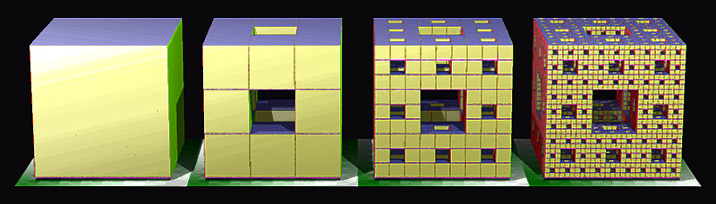

## ITI0102 - Programmeerimise algkursus
### Fraktaal
#### _fractal_

---

## Teema

- Fraktal (ka fraktaal, ingl _fractal_)
 - Julia hulgad
 - Mandelbroti hulk
- Enesesarnasus - iga kujundi osa sarnaneb tervikkujundiga

---

## Benoit Mandelbrot <br/>(1924 - 2010)

@snap[north-east mandelbrot]

@snapend

@ul[small](false)
- Poola sündinud prantsuse-ameerika matemaatik
- Fraktalite avastaja
- Arvutite areng on otseselt seotud fraktalite avastamisega – Mandelbrot kasutas arvutigraafikat fraktaalsete geomeetriliste kujundite loomiseks ja kuvamiseks
- Ta avastas Mandelbrot'i hulga 1979. aastal IBM-is  töötades
- Fraktalid aitavad seletada mitmeid n-ö karedaid või kaootilisi nähtusi.
 - pilved
 - kaldajoon
 - galaktikate jaotus (?) (vt _fractal cosmology_)
@ulend

---

## Theory of roughness - mäed


---

## Theory of roughness - rannajoon


---

## Theory of roughness - jääkristall


---

## Theory of roughness - Romanesco


---

## Koch'i (H. von Koch) lumehelbeke

- Külgede arv: N(i) = N(i-1) * 4^i


---

## Mengeri käsn



---

## Sierpinski kolmnurk

- **Kaose mängu** meetod (_chaos game_)
1. Vali suvalised kolm punkti (kolmnurk)
2. Vali suvaliselt üks punkt mis jääb kolmnurga sisse
3. Vali suvaliselt üks kolmnurga tipp
4. Liigu pool teed punktist valitud tipu poole
5. Märgi saadud punkt
6. Korda alates punktist 3.

@snap[north-east sierpinski]

@snapend

---

## Sierpinski Pillowga

```python
from PIL import Image
import random


def main():
    size = (1000, 1000)
    img = Image.new("RGB", size, 0)
    triangle = [(size[0]//2, 50), (50, size[1]-50), (size[0]-50, size[1]-50)]
    point = (300, 600)
    for _ in range(1000000):
        random_vertex = random.randint(0, 2)
        point = (point[0] + ((triangle[random_vertex][0] - point[0]) // 2),
                 point[1] + ((triangle[random_vertex][1] - point[1]) // 2))
        img.putpixel(point, (255, 0, 0))
    img.save("sierpinski.png")


if __name__ == "__main__":
    main()
```

---

## Itereeritud funktsioonisüsteem

```python
from PIL import Image
import random

def main():
    size = (1000, 1000)
    img = Image.new("RGB", size)
    point = (0, 0)
    for _ in range(10000000):
        img.putpixel((int(point[0]*100+500), int(size[1] - 1 - point[1]*100)), (0, 255, 0))
        r = random.randint(0, 3)
        if r == 0:
            point = (0, 0.16*point[1])
        elif r == 1:
            point = (0.85*point[0] + 0.04*point[1], -0.04*point[0] + 0.85*point[1] + 1.6)
        elif r == 2:
            point = (0.2*point[0] - 0.26*point[1], 0.23*point[0] + 0.22*point[1] + 1.6)
        else:
            point = (-0.15*point[0] + 0.28*point[1], 0.26*point[0] + 0.25*point[1] + 0.44)

    img.save("barnsley.png")

if __name__ == "__main__":
    main()
```

---

## Barnsley<br/>sõnajalg

@snap[west barnsley]

@snapend

@snap[east barnsley]

@snapend

---

## Põleva laeva fraktaal


- Avastati aastal 1992 (M. Michelitsch ja O. Rössler)
- https://en.wikipedia.org/wiki/Burning_Ship_fractal

@snap[south ship]

@snapend

---

## Põleva laeva fraktaal


---

## _Escape-time fractals_

@snap[east]

@snapend

@ul[small]
- Iteratsioonidel põhinevad fraktaalid
- Defineerime pinna (kaks telge)
 - X võtame reaalteljeks
 - Y võtame imaginaarteljeks
 
- Valime punkti pinnal (X, Y)
- Suurendame iteratsiooni loendurit
- Rakendame iteratsiooni valemit, näiteks: ``Zn+1 = Zn^2 + ?``
- Vaatame, kas läks piiridest välja
- Kui ei, siis kordame iteratsiooni
- Kui jah, siis värvime punkti vastavalt läbitud iteratsioonide arvule (ja hakkame järgmist punkti arvutama)

@ulend

---

@snap[north]
Julia hulgad
@snapend

@snap[midpoint julia]

@snapend

@snap[south]
`Z(n) = Z(n-1) ^2 + C`
<br/>
C - kompleksarvuline parameeter, mis määrab fraktali kuju
@snapend

---

@snap[north]
`c = 0.285 + 0.01i`
@snapend

@snap[midpoint julia]

@snapend

---

@snap[north]
`c = -0.7269 + 0.1889i` 
@snapend

@snap[midpoint julia]

@snapend

---

## Julia hulgad ja Mandelbroti hulk


---

## Kompleksarvud Pythonis

- `i` asemel kasutatakse `j`

```python
import math

c = 1.23 + 4.56j
norm_c = math.sqrt(c.real**2 + c.imag**2)
print(norm_c)

# 4.722975756871931
```

---

## Viited

- https://en.wikipedia.org/wiki/Fractal
- https://en.wikipedia.org/wiki/Benoit_Mandelbrot
- https://en.wikipedia.org/wiki/Julia_set
- https://www.wikihow.com/Plot-the-Mandelbrot-Set-By-Hand